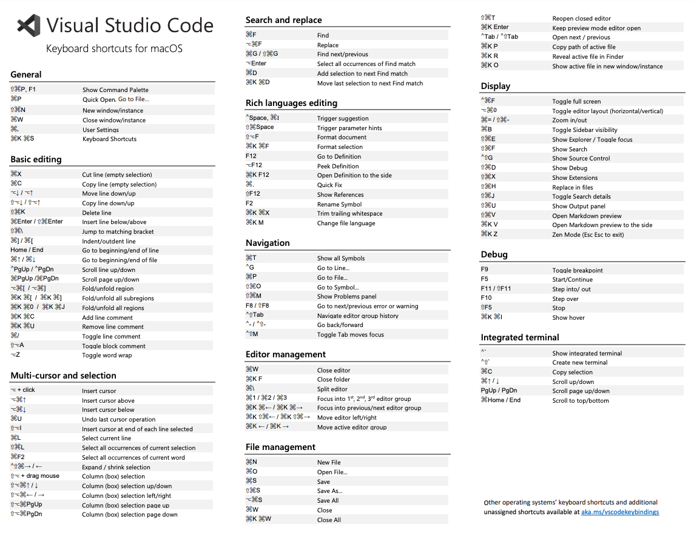

## Introduction

🏄‍ 前端开发领域中VSCode工具的基本使用和高效使用指南。

## [VSCode的介绍和基本使用](./use/VSCode的介绍和基本使用.md)

## [VSCode好用插件推荐列表](./plugin/VSCode%E5%B8%B8%E7%94%A8%E6%8F%92%E4%BB%B6%E5%88%97%E8%A1%A8.md)

## [VSCode工具常见配置清单](./setting/VSCode常见的配置.md)

## [VSCode快捷键和使用指南](./Shortcut%20keys/VSCode快捷键使用.md)

  VSCode快捷键大全
  - [官方PDF版本快捷键大全地址](https://code.visualstudio.com/shortcuts/keyboard-shortcuts-macos.pdf)
  - 打开方式
    - `打开外部链接` VSCode工具 -> 帮助 -> 键盘快捷方式参考 
    - `打开内置面板` Command + K && Command + S
  

